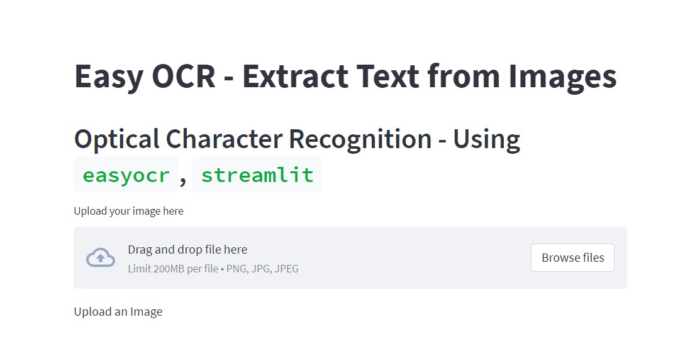
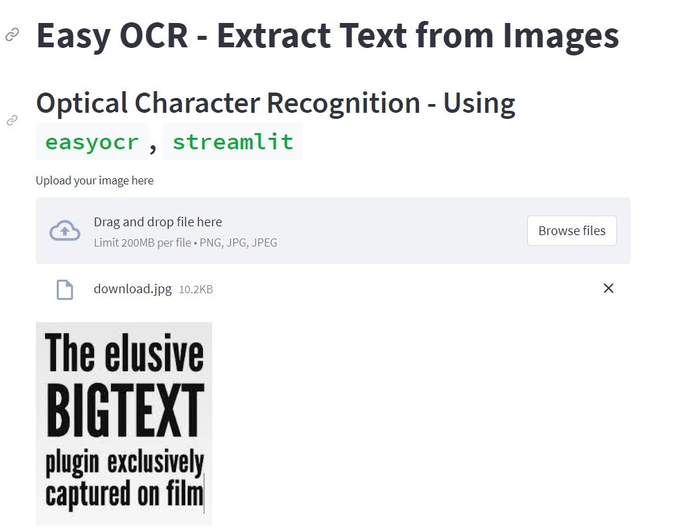
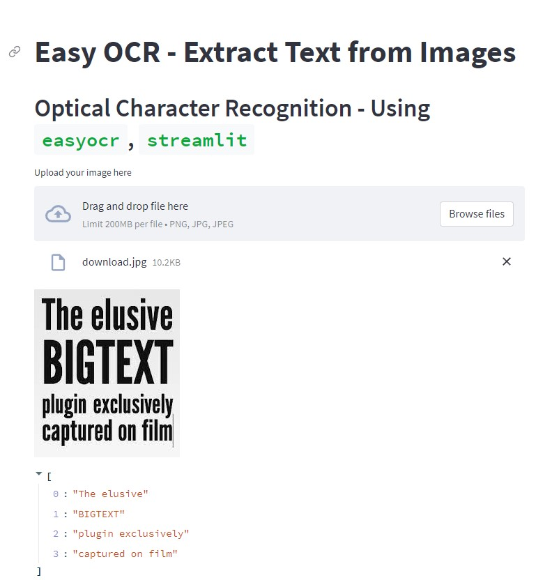

# ML_Ocr_app

![Hugging Face](https://img.shields.io/badge/-Hugging%20Face-white?logo=data:image/png;base64,iVBORw0KGgoAAAANSUhEUgAAACAAAAAgCAYAAABzenr0AAAABGdBTUEAALGPC/xhBQAAACBjSFJNAAB6JgAAgIQAAPoAAACA6AAAdTAAAOpgAAA6mAAAF3CculE8AAAAB3RJTUUH5gwNEQgk0m3AfQAAAAZiS0dEAP8A/wD/oL2nkwAACUpJREFUWMPFl1uMZFd1hr+1zz6nTt27p7q6p2emB88F7BnhS+wolgMmAgNjRJQYQYAQIRErSuCFSxIlUpTkIQ/JQ4KNHQmRSERCQkIIyQwS4mIkiJGVYIEsg2wyDGHGznjG01Ndfanruey9Vx5OTTPGiBDlISXtOiXVWXv9e+3//9fe8P/8kV/mpeGjEFkoC0BvjBbECBoU9Kd/qMBWAr0C1j76fwBw7RMQDER+MXFGQsQqwgngGEJPDKkGSpQhcBHlvHdctXWcAv0aXM1h/WP/CwDDR6GYg00gQiidrorwJlMzbzP15O6ola6ZRtI0iY0xgoaAFt75aT4Nk+yKnxXf1lIfU+XJyDITU83b+8gvAWDrYRCB4IFAC8M7TCP+o7jfvite66T2QAuTWiSKwNwQHhR1npCVlIMxxZWd3XI4/bIW4eO5k2fSWrVF/Y/9AgCDh0EUAiCBV0ti/ipe67wzPd5v2F4LsVFFAv2fNlQIWUlxaZvswrVzfpT/pc95zNRR+RkQ+yGDTywIpkDgTtOwj6QnVl+fHl9FavZlJHtFXqlmcg5stODL4qu8Nmb23ItX3XD20Xqz8fn5fPayStj9CuZgYtDALVEj/sf66UO/nt7Uq8qsWiXhlThEYDxRvvytkmfPe44eMrz9jTFHDhoUiNc6NM2Rg5NnLv3dbGd2WSKe1J8t2tZDlXTU0zU180/1W9bfU3/1WiUzAe9hZ09RYLkj2BsK4hw88pmMT38+ZzpXbCS88R7L3/5pnbUVU70nkL8wZPr9S18Nc/9+sQyvV8ECGKCwhiiEd8UHuw+kx/r7yWdz5bNnC774eIEqvPXemN9/V43lroDA5c3Al75RElvh3W+POX8h8Ox5z08uwlo7JniQSEnWD1BeG92XP7/92yLyLyrVCuyPHwXvQGahbzrxg+mxfk2SxRIFvvbtkkc/k1GUVbk/+dmcWiJ86PdqmMV+r60IZ+61/MkfpFwdKBcvCqfXmpTXEtQbJHGYdkHt8EpSbo7e58fuMUnYBbAnMxjGIIbX2V7rDrvc3N/zsoTvPOOYZ/Dg79Q4tmH4wlcKQoCgIAE21g2f/JsmzTrUU+HY4Yib2inlVhM/SikLwTZLomCI2l2ipcadfjq6HXhi6yGwAws/+hTc8iF5XbzSakgcQYBQGkwQ7r2jRn8p4sF3J/QOCPf/RkyaQLQwF2NgtSf7BNVS8LMYnSU8/VzJ08/PeO8bunTqMbRr2OXWcnl1dA9J9ITkHisCr/kALZPY01GnDl4Ik4QwS1BnOHNbg/vvzrHtEg2BA115hRqu/xYBiWBaBL7+vV3++WvbvOX0MmlNUBPAKLZTR5LotW7H12iS24UW6kSybtIqsd9pEEYpWhpM6pFORLAzTDP/uTJkMfIMnj1X8rkvDvn6v2f86okGv3tfm2QpR+olEjtMM0asOSrWN+A6AIjESAOJ0MwSpglhr04xsezJlNbBiE4jImpLZZXXvcNVKtnaUX5wzvOvT5U8+T3HYKjcfWvMn3+gxcH1DOIS0ywQ6yo3FbOMEN9oRAGlJICq7FvZeO75+BMvsVNmnDwmrK4H2i0IAbJc2Rwql654fvxC4NpWYDqHRgq/dV/Mh9+fcvxQQfAFmFAB9woeBKLrHnQdQKEhbKsrMKkjNEqMy+jVDX/4m12+8N2Sx5+asrkdrqsTHyogUJllqwm/dmvEO8/EvO3emE4Lgnc/bS6h4kqYezToVAS/D0AdM3XhYpjnb7CdgqijhMRhvOHUhucv7qrzviE89YPKbq9sVquNIuh1hWNHDHeeiviVU4aVJQNBCdmCnFoBUBeqJjXOwYcXxTMXC1aBWscWLneXysGYMCvwM0+y1gNjCCaQtBJu7go3H08ocmU+V5wDQUmsUK9BJBC8ErLKJNQrfppXhhGUYriHsZaQl4TSPT+ZM2umVDIsnbvDdtK3lIOxauklObxMduESYg3YCLtbp3a4B1IhbteAuGrLGhQyxQUWyUB9oBjsEMocLQNaONKTffLLO/jJnKiVvr6p2e0iPFO1LM+p5FD3pubtG6hXok5KcuQAUatO/eaD+ElGcXkXzRXNAmG+GLOATn31nHl0Wo3y6h7BF9RPrxN1UmrHelQeozTv2NDkUHcDz6mKP4HVqB69ubg2Rmy0V9tYJr+4RdxvY+oxfpSRnlyl3B7jhjN0P9ki+dSjE4eOHWHsccMZbj6l/po1/O4ck8bE/TbZTwYkR5cRG+2VmyM19eg+PH0TAnfFh5bONF97OMkuDEamWZvZlTblYEy0VMdtjTHNGvF6h2JzlzBx6NgTxo4wWoyxr8bEUY5GJBtdTKtGuT3B9hqUm2Pi1TZROx1nFwZ7jVuP1JJDS2c0cJcBfuiGk2cBmx5faWcXB2OxpkwOLeH35ph2ikSGeK2DBoffyQhjh04Wq58HNAtoqYSihESJD3aRyGA7KX40Jzm6jGnYcf781m56vN8BrNuaPAf8h8FQhNyV83NXR1r4UD+x2kA1iDWgYNtppfXYErVq+GmOFoq6hb5v7AmuJOrWMEllL2YRK7FRDWh6YrUbChfm514ahcIVCLnBs2aXm0cbtx1punE2d7uzvbjftogQdeuE3KF5QGcBgqD6i06kWr0zC1VM7iryIRL3mk23Mx350XzeuG2jaZcbR/GsGYEfue3J2eLFnVn6ql4/Xml3KmUoUSPF2Bphz+EHGW5njrl+CuGGLgSoehRw21P8ICPsOYytETXSyoIV4pV2J71ppV9c3pm67elZEc5Hf3Y/DqdP+71pEjJ30h5odcVEMVkQnQbIIYycz18aZuXu7nYIpQuuiILLouDm+HKGL6aFy8ZjV0wu+CL/L/GmbUzNGhOZ/ZO2iGjpmZ278lJ+cevTWujDGKZy7e9BDKijJpYHoqX6B5P+0mlbb7YppR5mZVHujYblZO8b6v3DqixJdTXrIcQoc6iuZQr/KUJdTPTXcav71rjbOWAacYINmctmo2Kw+0O/N/9UKDlrEnJVEFUY/EN1kPCtGLNTvkpizpgkvgeRFXwYBee+CZwFhjdePqptfzknqklZQXjAWPsmjOmADkJR/ps6Hpd2/ALzEqQ6Fe9Pt/XQonEJRImlGLm6WFIRCpPaqTrHbA9aB6D34Z9Pw+1HYHMAKz2QyBJy11QlUUeWtOzce7ePuf/HVcx/A83R6EK1NrpfAAAAJXRFWHRkYXRlOmNyZWF0ZQAyMDIyLTEyLTEzVDE3OjA4OjMyKzAwOjAwd8pcZAAAACV0RVh0ZGF0ZTptb2RpZnkAMjAyMi0xMi0xM1QxNzowODozMiswMDowMAaX5NgAAAAASUVORK5CYII=)

**ML_OCR_App** can convert picture to text.The picture must contain English.

# How to use ?

1. Use the [streamlit application](https://delroso-ml-ocr-app-streamlit-app-app-2rx2sv.streamlit.app/).

2. Drag and drop or upload a file.

3. Wait for the download and get a response.

